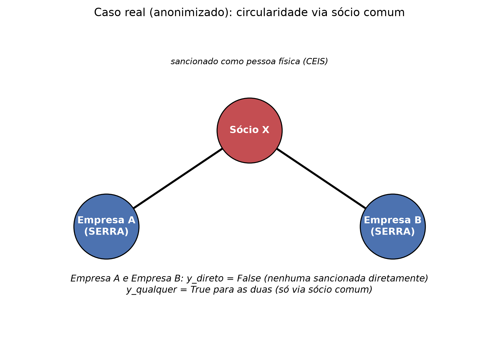

# Título provisório

**Modelos Simples, Sinal de Grafo Explícito: Repensando Redes Neurais em
Grafos Heterogêneos para Triagem de Risco de Sanção Administrativa em Dados
de Governo Local**

*(provisório — não há template ABNT obrigatório da instituição informado até
o momento; estrutura livre de dissertação de mestrado, capítulos de
conteúdo. Capa/folha de rosto/ficha catalográfica/resumo formal ficam para
quando o formato institucional for confirmado.)*

> **Status deste rascunho (atualizado em 15/08/2026)**: sincronizado com a
> revisão feita em `docs/manuscrito/paper_en.md` a partir de um parecer
> simulado de revisor experiente (alvo GIQ), que recomendou revisão maior
> em 5 pontos — todos aplicados aqui também: (1) engajamento com literatura
> de adoção de IA no setor público (Seção 2.1), (2) alegação de novidade
> reformulada de "descoberta" pra "replicação rigorosa", (3) ressalva sobre
> o teste de Wilcoxon em CV repetida (Seção 5.5), (4) explicação da Seção
> 5.2 suavizada de conclusão direta pra interpretação fundamentada em
> literatura mas não testada, (5) seção de disponibilidade de dados/código.
> Mais 2 melhorias de "nota" aplicadas depois: reforço adicional do fit com
> a GIQ (Matheus et al., 2021) e um esboço de implantação prática na Seção
> 5.4. Mais uma melhoria (15/08/2026): ablation dedicado (Seção 4.6)
> isolando a contribuição marginal dos dois grupos de feature da rodada 3 —
> revisou a leitura original da Seção 5.2 ("features de grafo explícitas
> fecham a diferença") pra uma explicação mais nuançada e melhor
> sustentada pelos dados (ver Seção 4.6/5.2). Todos os números computados
> direto dos logs
> `docs/resultados/comparar_baselines_30folds_v4_han_hgt_tunado_2026-08-14.log`
> e `docs/resultados/ablation_features_tabular_2026-08-15.log`, reconferidos
> contra `docs/research_plan.md`, não recuperados de
> memória; todas as citações verificadas em fonte primária.

---

## Resumo

Órgãos de controle em governo local e regional são cada vez mais chamados a
triar grandes cadastros corporativos por risco de sanção administrativa —
evasão de listas de impedimento, uso de empresa de fachada, e vínculo
político não declarado — com orçamento limitado de ciência de dados e sem
infraestrutura dedicada. Redes neurais em grafo (GNNs) que modelam redes
corporativas explicitamente (sócio comum, endereço comum, vínculo político)
são frequentemente propostas como a resposta de estado da arte, sob a
suposição de que risco estrutural só é visível a um modelo relacional.
Testamos essa suposição num cadastro real e completo de 344.130 empresas de
uma região metropolitana brasileira, comparando um baseline tabular com
gradient boosting, uma GNN homogênea, e um transformer de grafo heterogêneo
(HGT), sob uma moldura positivo-incompleta apropriada à raridade extrema de
sanção confirmada (148 diretas, 188 incluindo casos inferidos via sócio).
Nosso achado ecoa um padrão reportado em pelo menos um benchmark
contemporâneo num domínio de fraude diferente (Vandervorst et al., 2025); a
contribuição desta dissertação é testar isso com escrutínio metodológico
substancialmente maior, e num domínio novo de setor público onde as
implicações práticas da resposta são diferentes. Ao longo de cinco rodadas de avaliação independentes — três iterações
sucessivas de engenharia de features mais uma rodada dedicada de busca de
hiperparâmetros para o HGT, todas sob validação cruzada estratificada
repetida (30 folds) com teste estatístico pareado —, o modelo heterogêneo é
consistente e significativamente superado por ambas as alternativas mais
simples no rótulo principal, não-circular (tabular: lift de 50,7× sobre a
taxa-base; GNN homogênea: 76,3×; HGT tunado: 32,6×; tabular > HGT,
p = 0,0024; GNN homogênea > HGT, p < 0,0001). Criticamente, uma busca
dedicada de hiperparâmetros — motivada pelo achado de que o HGT estava
subtreinado, não subdimensionado — melhorou seu desempenho em 39%, mas não
mudou esse ranking, fechando a objeção metodológica mais provável ao
resultado. Num rótulo secundário, onde o próprio mecanismo de rotulagem se
sobrepõe ao metapath de sócio comum, a vantagem do HGT tunado cresce em vez
de diminuir (lift de 60,8×, ante 42,8× antes do ajuste) — um padrão mais
consistente com o modelo explorando circularidade de rótulo do que
descobrindo sinal genuíno de risco estrutural. Discutimos a implicação
prática para órgãos de controle com recursos limitados: um modelo tabular
bem projetado, aumentado com features explícitas de grau de grafo, não um
transformer de grafo heterogêneo, é a escolha defensável para essa tarefa
dado o orçamento computacional e de rotulagem realista do setor público.

**Palavras-chave**: risco de sanção administrativa; redes neurais em grafos
heterogêneos; detecção de anomalia; ciência de dados no setor público;
análise de rede corporativa; aprendizado positivo-não-rotulado.

## Abstract

*(English version of the abstract above — see `docs/manuscrito/paper_en.md`
for the version drafted directly in English, which this should mirror once
both are finalized together rather than translated mechanically.)*

---

## 1. Introdução

Administrações públicas em qualquer nível mantêm cadastros das empresas com
as quais se relacionam — como contribuintes, como participantes de licitação,
como beneficiárias de incentivo fiscal, como empregadoras. Uma fração pequena
dessas empresas acaba sendo formalmente sancionada por irregularidade grave o
suficiente para entrar numa lista de impedimento (no Brasil, os registros
federais CEIS e CNEP, equivalentes estaduais, e listas setoriais como o CEPIM
para entidades sem fins lucrativos irregulares). Para um órgão de controle —
tribunal de contas, controladoria, órgão de fiscalização de licitação — a
pergunta prática não é retrospectiva ("essa empresa foi sancionada?"), é
prospectiva: *entre as empresas ainda não sancionadas, quais concentram risco
suficiente para justificar escrutínio agora?*

A adoção de IA e aprendizado de máquina no setor público está se expandindo,
mas consistentemente limitada por barreiras de capacidade técnica,
qualidade de dado, e competência de pessoal, não pela disponibilidade de
modelo (Sun & Medaglia, 2019) — um corpo de evidência que esta dissertação
trata como restrição de desenho desde o início, não como ressalva
acrescentada depois: qualquer escolha de modelagem recomendada aqui precisa
ser justificável a um órgão de controle com exatamente essas restrições,
não só a um público de aprendizado de máquina com poder computacional
ilimitado.

Dois fatos estruturais tornam esse um problema de triagem difícil. Primeiro,
sanção confirmada é extremamente rara frente ao tamanho de qualquer cadastro
real — no dataset usado aqui, **188 casos confirmados em 344.130 empresas
(0,055%)**. Qualquer modelo treinado sobre esse rótulo está aprendendo de um
sinal **positivo-incompleto (PU — positive/unlabeled)**: ausência de registro
de sanção significa *ainda não foi pega*, não *sem risco*. Segundo, risco
corporativo é frequentemente relacional, não intrínseco aos atributos
declarados de uma única empresa: uma empresa com cadastro fiscal
aparentemente comum pode compartilhar sócio, endereço registrado, ou vínculo
político não declarado com uma entidade já sancionada — sinal invisível para
um modelo que trata cada empresa como uma linha independente de atributos.

Esse segundo fato é a premissa de um corpo crescente de trabalho aplicando
redes neurais em grafos heterogêneos (HGNNs) — modelos que tratam empresas,
sócios, endereços e outras entidades como tipos de nó distintos, conectados
por relações tipadas — a risco corporativo, majoritariamente em crédito e
insolvência (ver Seção 2). A promessa implícita dessa literatura é que
modelos relacionais, treinados de ponta a ponta, recuperam sinal estrutural
de risco que abordagens tabulares mais simples não conseguem.

Esta dissertação testa essa promessa diretamente, num cenário mais próximo do
que um órgão de controle real e com recursos limitados de fato teria
disponível: um cadastro empresarial real e completo de uma região
metropolitana brasileira (a Grande Vitória, Espírito Santo, sete municípios),
construído numa Rede Heterogênea de Informação (HIN) com três metapaths
escolhidos por relevância direta para fiscalização de risco administrativo —
**sócio comum**, **endereço registrado comum**, e **vínculo político comum**
(via registros eleitorais federais do TSE) — avaliado sob o desbalanceamento
extremo e a condição de rótulo PU que são a norma nesse domínio, não uma
exceção a ser contornada por ajuste fino.

### 1.1 Pergunta de pesquisa

> Metapaths estruturais numa HIN de empresas (sócio comum, endereço comum,
> vínculo político) melhoram a identificação de empresas com sanção
> administrativa confirmada, em relação a um baseline tabular — e quais
> metapaths carregam mais sinal?

### 1.2 Contribuições

1. **Uma comparação empírica real e reprodutível** entre um baseline tabular
   (gradient boosting), uma GNN homogênea, e um transformer de grafo
   heterogêneo (HGT), sob um protocolo de avaliação estatisticamente
   rigoroso e compartilhado (validação cruzada estratificada repetida, teste
   de Wilcoxon pareado em 30 folds), replicada em três iterações sucessivas
   de engenharia de features e uma rodada dedicada de ajuste de
   hiperparâmetros — um nível de escrutínio metodológico incomum na
   literatura prévia de fraude/risco em grafo, que tipicamente reporta uma
   única configuração.
2. **Um teste direto de se aprendizado estrutural implícito supera feature de
   grafo explícita**, testando diretamente uma afirmação da literatura de
   features-de-grafo-vs-GNN (Seção 2.3) num domínio novo: aqui, não supera —
   um modelo tabular com os mesmos três metapaths como feature de grau
   explícita, e uma GNN homogênea ainda mais simples, superam
   significativamente o modelo totalmente heterogêneo no rótulo principal
   (Seção 4.1), resultado que sobrevive a uma rodada dedicada de ajuste de
   hiperparâmetros (Seção 4.4).
3. **Um conjunto de features para triagem de risco de sanção administrativa
   fundamentado em literatura de corrupção em compras públicas e detecção de
   empresa de fachada** (Seção 2.4), adaptado ao que é realisticamente
   disponível num cadastro municipal brasileiro: contratação sem
   concorrência, sobrepreço contratual, idade da empresa, e concentração de
   sócio em muitas empresas.
4. **Uma discussão prática, voltada a quem fiscaliza, não só a quem pesquisa
   aprendizado em grafo**, sobre qual abordagem de modelagem é *de fato*
   justificada dado o orçamento computacional, a capacidade técnica, e a
   escassez de rótulo com que um órgão de controle real opera — não o que é
   justificado num cenário de benchmark idealizado e bem-provido de recursos.

O restante do texto está organizado da seguinte forma. A Seção 2 situa este
trabalho em quatro literaturas: detecção de risco administrativo/corporativo
em dado público brasileiro, GNNs heterogêneas para redes corporativas, o
debate features-de-grafo-vs-GNN em detecção de fraude, e aprendizado em grafo
com desbalanceamento/poucos rótulos. A Seção 3 descreve os dados, a
construção do rótulo, o desenho da rede, a engenharia de features, os
modelos e o protocolo de avaliação. A Seção 4 reporta os resultados de cinco
rodadas de avaliação, um estudo de ajuste de hiperparâmetros, e uma análise
de sensibilidade. A Seção 5 discute os achados da perspectiva de quem
fiscaliza e declara limitações. A Seção 6 conclui.

---

## 2. Referencial teórico

### 2.1 Adoção de IA na fiscalização do setor público, e risco administrativo e corporativo em dado público brasileiro

A literatura da própria Government Information Quarterly sobre adoção de IA
na administração pública constata consistentemente que a restrição real
pra implantar ferramentas preditivas em governo é capacidade organizacional
e técnica — competência de pessoal, qualidade de dado, infraestrutura —
não a disponibilidade de um modelo capaz (Sun & Medaglia, 2019). Esta
dissertação trata esse achado como requisito de desenho, não ressalva
posterior: a Seção 3.1 delimita deliberadamente o estudo a um conjunto de
dados e orçamento computacional realista pra um órgão de controle com
poucos recursos, e a Seção 5.4 avalia cada modelo explicitamente contra
essa restrição, não só contra desempenho preditivo. Uma literatura
relacionada de princípios de desenho pra transparência digital em governo
(Matheus, Janssen, & Janowski, 2021) trata auditabilidade e legibilidade
institucional de uma ferramenta digital como objetivos de desenho em si,
não só como formalidade de conformidade — uma consideração que esta
dissertação estende de transparência de *processo* pra transparência de
*modelo*: um modelo com gradient boosting cujas importâncias de feature são
diretamente inspecionáveis é mais legível pra função de auditoria do
próprio órgão de controle do que os embeddings aprendidos de um transformer
de grafo heterogêneo, independente de qualquer diferença de desempenho
preditivo entre eles (Seção 5.4).

Dentro dessa restrição, trabalho brasileiro prévio sobre risco corporativo
e detecção de fraude com dado de cadastro público é majoritariamente
tabular, tratando cada empresa como uma observação independente descrita
por atributos de cadastro, regime tributário, dívida, e código de setor.
Esse corpo de trabalho não modela,
até onde se sabe, a *rede* de relações entre empresas — sócio, endereço,
vínculo político compartilhados — como objeto de primeira classe, apesar de
essas relações serem diretamente consultáveis nas mesmas fontes de dado
público (cadastro da Receita Federal, registros eleitorais). Trabalho
internacional aplicando modelos relacionais (HAN, HGT, R-GCN) a redes
corporativas existe, mas concentra-se fortemente em risco de crédito e
insolvência — um problema comparativamente rico em dado e bem rotulado —
deixando detecção de risco de sanção administrativa via metapaths de
propriedade/endereço/vínculo político, em contexto de dado público
brasileiro, comparativamente inexplorada.

### 2.2 Redes neurais em grafos heterogêneos para redes corporativas e financeiras

Arquiteturas de atenção/transformer para grafo heterogêneo — HAN (Wang et
al., 2019) e HGT (Hu et al., 2020) à frente — estendem redes neurais em
grafo além de um único tipo de nó/aresta, aprendendo pesos de atenção
específicos por tipo ao longo de metapaths ou relações. Aplicada a redes
corporativas, essa família de modelos mira risco de empresa de fachada e
beneficiário final (Moody's, 2023) e fraude financeira mais amplamente, sob
a premissa de que anéis de fraude deixam uma assinatura estrutural —
infraestrutura compartilhada, contrapartes compartilhadas — "invisível no
espaço de features, mas detectável na topologia do grafo". Uma literatura
paralela sobre redes de empresa de fachada em compras públicas corrobora
essa premissa com um mecanismo concreto: dado de propriedade/gestão,
combinado com dado de contratação, revela componentes conectados indicativos
de risco de conluio (Seção 2.4).

### 2.3 Features de grafo versus treino de GNN de ponta a ponta

Uma literatura distinta e diretamente relevante faz uma pergunta mais
estreita e mais cética: um GNN treinado de ponta a ponta supera um baseline
muito mais simples ao qual se dá *a mesma informação estrutural
explicitamente*, como feature de grafo projetada (grau, centralidade,
PageRank, agregados de vizinhança) alimentando um modelo de árvores com
gradient boosting? Evidência de benchmarks de detecção de fraude sugere que a
resposta é frequentemente "não, ou não por muito". Um benchmark recente em
detecção de fraude de seguros compara explicitamente gradient boosting
contra HinSAGE, HAN e HGT, constatando que "abordagens de árvore com
gradient boosting sobre dado tabular ainda dominam o campo" e que
abordagens baseadas em grafo especificamente sofrem sob o desbalanceamento
de classe alto típico de dado de fraude (Vandervorst et al., 2025) — a mesma
combinação de condições (grafo heterogêneo, desbalanceamento extremo)
estudada nesta dissertação. Uma linha de trabalho separada, que combina
gradient boosting com estrutura de grafo diretamente (em vez de compará-los
como rivais), mostra ainda que modelos baseados em GBDT conseguem igualar ou
superar arquiteturas de GNN puras uma vez que a informação de grafo é
disponibilizada a eles numa forma adequada (Ivanov & Prokhorenkova, 2021). O
desenho desta dissertação — dar os *mesmos* três metapaths ao baseline
tabular como feature de grau explícita, e ao modelo heterogêneo como
estrutura aprendida — é um teste direto dessa afirmação num domínio novo.

### 2.4 Indicadores de risco de corrupção em compras públicas e detecção de empresa de fachada

Trabalho empírico transnacional sobre risco de corrupção em compras públicas
(Fazekas & Kocsis, 2020; Abdou et al., 2022) estabelece indicadores objetivos
de contratação sem concorrência e sobrepreço — modalidade de contratação por
dispensa/inexigibilidade de licitação, e divergência entre valor inicial e
final do contrato — como proxies robustos e auditáveis de risco de corrupção,
independentes de qualquer desfecho processual. A prática de detecção de
empresa de fachada (Moody's, 2023; literatura de rede de empresa de fachada
em crime organizado em compras públicas) identifica ainda idade da empresa e
concentração de sócio/diretor em muitas empresas como sinais de alerta
práticos. Esses quatro indicadores são diretamente relevantes, e viáveis de
construir a partir do dado de cadastro usado neste estudo (Seção 3.4), e
motivaram uma rodada dedicada de engenharia de features fundamentada em
literatura antes do experimento final aqui reportado.

### 2.5 Aprendizado em grafo com desbalanceamento e poucos rótulos

Um corpo de trabalho específico de detecção de fraude em grafo endereça
desbalanceamento de classe e escassez de rótulo no nível de arquitetura, não
só de função de perda. PC-GNN (Liu et al., 2021) e CARE-GNN (Dou et al.,
2020) reamostram ou selecionam vizinhança via aprendizado por reforço para
contrapor tanto desbalanceamento de classe quanto "camuflagem" adversarial
por nós fraudulentos, reportando ganhos consistentes sobre agregação de GNN
ingênua em benchmarks de fraude desbalanceados. Um diagnóstico intimamente
relacionado, diretamente aplicável ao cenário desta dissertação, vem de
trabalho recente sobre detecção de fraude corporativa em grafos financeiros
"ricos porém ruidosos" (Wang et al., 2025), que identifica **sobrecarga de
informação** — a dominância numérica de tipos de nó sem informação de
atributo genuína (aqui: nós de sócio, endereço e vínculo político
compartilhados, que carregam só um embedding aprendido, não features reais)
sobre o tipo de nó-alvo — como um mecanismo específico pelo qual
message-passing heterogêneo ingênuo pode *diluir*, em vez de enriquecer,
sinal quando rótulos são escassos. Separadamente, uma literatura pequena mas
crescente de aprendizado positivo-não-rotulado (PU) em grafo (perdas PU
conscientes de estrutura; Yang et al., 2023) endereça o problema de
incompletude de rótulo que a própria construção de rótulo desta dissertação
compartilha, ainda que não integrada a um objetivo de treino de GNN
heterogênea no cenário de risco corporativo. Essa literatura é retomada na
Seção 5.2 para interpretar o achado de que o modelo heterogêneo mais
complexo, treinado de ponta a ponta, tem desempenho pior que alternativas
mais simples exatamente sob as condições (desbalanceamento extremo, poucos
rótulos, tipos de nó auxiliares pobres em atributo) para as quais essa
literatura foi desenhada.

---

## 3. Metodologia

### 3.1 Fonte de dados e escopo do estudo

O dataset vem de um pipeline de ETL mantido e publicamente documentado
(`projeto_grande_vitoria_empresas`) que consolida diversas fontes de dado
público brasileiro num único banco relacional, casadas por CNPJ: o cadastro
de empresas da Receita Federal, os registros federais de
impedimento/sanção (CEIS, CNEP), o registro do tribunal de contas estadual
(TCEES), o registro de irregularidade de entidade sem fins lucrativos
(CEPIM), registros de dívida ativa, registros de constituição empresarial
estadual (JUCEES), registros de infração ambiental, registros de contrato
governamental, registros de benefício fiscal, e registros de vínculo
político do TSE (candidatura/doação eleitoral). O escopo do estudo é a
região metropolitana da **Grande Vitória** (Espírito Santo, sete
municípios): **344.130 empresas cadastradas**, uma escala totalmente
tratável em memória em hardware comum — escolha deliberada, já que o público
para as conclusões práticas deste trabalho é órgão de controle sem
infraestrutura de big data dedicada.

**Ética e privacidade de dados.** O CPF do sócio já vem mascarado na fonte
pelo cadastro federal emissor — sem necessidade de pseudonimização adicional
pra esta pesquisa. Registros de vínculo político (Seção 3.3) vêm de
declarações públicas de candidatura/doação eleitoral do TSE. Nomes de sócio
e identificadores de empresa são usados internamente pra construir a rede e
as features, mas — compromisso ético desta pesquisa — nunca são publicados
em resultado agregado, e são substituídos por rótulos genéricos (ex.:
"Sócio X", "Empresa A/B") em qualquer exemplo ilustrativo extraído de um
caso específico, incluindo a Figura 1.

### 3.2 Construção do rótulo e a moldura positivo-incompleta (PU)

Apenas **188 de 344.130 empresas (0,055%)** têm sanção administrativa
confirmada em registro. Tratamos isso como um problema positivo-incompleto:
ausência de registro de sanção indica que a empresa não foi (ainda) pega, não
que está livre de risco. Consequentemente, enquadramos a tarefa como detecção
de anomalia/ranking de risco, não classificação binária balanceada, e usamos
PR-AUC (e, de forma exploratória, Precision@k — ver ressalva na Seção 3.6)
como métrica de avaliação em vez de acurácia ou ROC-AUC, que são
não-informativas ou enganosas nessa taxa-base.

Uma segunda questão de rotulagem, mais sutil, interage diretamente com a
pergunta de pesquisa central desta dissertação. Das 188 positivas
confirmadas, **148 são sancionadas diretamente** (a própria empresa aparece
numa lista de impedimento) enquanto **40 são rotuladas como positivas só
porque compartilham um sócio com uma entidade já sancionada** — exatamente o
mecanismo que o metapath de sócio comum é desenhado para detectar. Tratar as
188 como um único rótulo arrisca circularidade: um modelo que "descobre"
risco de sócio comum nesse subconjunto não está descobrindo sinal novo, está
reproduzindo a regra de rotulagem. Reportamos os resultados primários sobre
o rótulo restrito às 148 sancionadas diretamente (`y_direto`) e tratamos o
rótulo completo de 188 empresas (`y_qualquer`, incluindo os casos inferidos
via sócio) como uma análise de sensibilidade declarada, nunca confundindo os
dois sem explicitar qual está em uso.

A Figura 1 mostra um exemplo concreto (anonimizado) desse mecanismo, extraído
do banco de dados real: duas empresas do mesmo município, nenhuma sancionada
diretamente, que compartilham um sócio que foi pessoalmente sancionado
(listado no CEIS como pessoa física). As duas empresas entram em
`y_qualquer` como positivas só por causa desse vínculo de sócio comum —
exatamente a relação que o metapath de sócio comum é desenhado para
detectar.

*Figura 1. Um caso real (identificadores anonimizados) ilustrando o
mecanismo de rotulagem via sócio comum por trás das 40 empresas que separam
`y_qualquer` de `y_direto`.*

### 3.3 Construção da rede heterogênea de informação

Construímos uma Rede Heterogênea de Informação (HIN) com cinco tipos de nó —
empresa, sócio, endereço, município, e vínculo político — e arestas
representando participação societária (`participa_de`), co-localização
(`sediada_em`), pertencimento municipal (`localizada_em`), e vínculo político
(`tem_vinculo_politico`). Três metapaths, escolhidos por relevância direta
para fiscalização de risco administrativo, não por conveniência
grafo-teórica, compõem a hipótese estrutural da rede: empresa–sócio–empresa
(sócio comum), empresa–endereço–empresa (endereço registrado comum), e
empresa–vínculo político–empresa (vínculo político comum, via registro de
candidatura/doação eleitoral). Um quarto metapath candidato via município
compartilhado foi excluído durante o desenvolvimento: com apenas sete nós de
município para 344.130 empresas, seu produto de adjacência é
combinatorialmente explosivo e não carrega sinal discriminativo relevante
(toda empresa compartilha município com dezenas de milhares de outras).
Extração de metapath usa produto de matrizes esparsas, não busca em
profundidade — requisito de escalabilidade nesse tamanho de rede (344.130 nós
de empresa).

*Figura 2. Esquema dos três metapaths empresa–X–empresa usados para
construir a rede heterogênea de informação (ilustração abstrata, não
extraída de empresas específicas).*

### 3.4 Engenharia de features

Além de atributos de cadastro padrão (capital social, porte, regime
tributário, setor, número de sócios, dívida ativa agregada, infração
ambiental, contrato governamental, situação de benefício fiscal),
construímos dois grupos de features motivados por literatura, diretamente
informados pelas Seções 2.3–2.4:

- **Features de grau de grafo explícitas**: para cada um dos três metapaths,
  o grau da empresa naquela adjacência (número de outras empresas
  alcançáveis via sócio/endereço/vínculo político comum), mais a
  conectividade do sócio mais conectado da empresa — dando ao baseline
  tabular acesso direto à mesma informação estrutural disponível aos modelos
  de grafo, como teste da afirmação features-de-grafo-vs-GNN (Seção 2.3).
- **Indicadores de corrupção em compras públicas e de empresa de fachada**:
  sinalizador de contrato sem concorrência e razão máxima de sobrepreço
  (Fazekas & Kocsis, 2020; Abdou et al., 2022), e idade da empresa a partir
  da data de constituição no registro comercial, com valor-sentinela
  explícito para empresas sem correspondência no registro (Moody's, 2023).

### 3.5 Modelos

Comparamos três modelos sob um protocolo de avaliação idêntico:

1. **Baseline tabular**: árvores com gradient boosting (XGBoost), com
   rebalanceamento de peso de classe por fold (`scale_pos_weight`), usando o
   conjunto de features completo da Seção 3.4, incluindo as features de grau
   de grafo explícitas.
2. **GNN homogênea**: as três adjacências de metapath colapsadas num único
   grafo empresa–empresa (com um teto de grau na adjacência de endereço
   comum — um pequeno número de endereços de grandes prédios comerciais
   respondem por uma fração desproporcional das arestas de endereço comum,
   um artefato de dado que exige poda antes de dominar o grafo), treinada com
   GraphSAGE sobre as mesmas features tabulares.
3. **Transformer de grafo heterogêneo (HGT)**: cada tipo de nó e relação
   modelado distintamente (Hu et al., 2020); só o tipo de nó empresa carrega
   features tabulares reais, os demais tipos de nó (sócio, endereço, vínculo
   político) carregam um embedding aprendido, já que não têm dado de
   atributo próprio no registro-fonte — exatamente a condição de "sobrecarga
   de informação" discutida na Seção 2.5.

Os três modelos foram reavaliados em três iterações sucessivas do conjunto de
features (107, 117 e 124 colunas) à medida que features motivadas por
literatura foram adicionadas (Seções 2.3–2.4), e os hiperparâmetros do HGT
(dimensão oculta, cabeças de atenção, épocas de treino) passaram por uma
rodada dedicada de ajuste antes de a configuração final reportada ser
selecionada — ver Seção 4.4 para o achado que motivou essa etapa (o modelo
estava subtreinado, não subdimensionado).

### 3.6 Protocolo de avaliação

Usamos validação cruzada estratificada repetida (5 folds × 6 repetições = 30
folds), com os mesmos folds e semente aleatória compartilhados entre os três
modelos para permitir teste estatístico pareado. Nosso harness de avaliação
computa tanto PR-AUC quanto Precision@k (k = 10, 20, 50) por fold; reportamos
PR-AUC como métrica principal ao longo desta dissertação e comparamos os
modelos dois a dois com o teste de postos sinalizados de Wilcoxon sobre o
PR-AUC por fold. Precision@k foi acompanhado durante o desenvolvimento mas
não é reportado nos resultados principais: com aproximadamente 148/5 ≈ 30
casos positivos por fold de teste, Precision@k nesses limiares é
substancialmente mais ruidoso fold a fold que o PR-AUC (seu desvio-padrão
entre folds frequentemente superou a média em rodadas exploratórias
iniciais), tornando o PR-AUC a métrica mais informativa e estável para as
comparações pareadas de que esta dissertação depende. Todos os resultados
são reportados tanto para o rótulo principal (`y_direto`, 148
positivas) quanto para o rótulo de sensibilidade (`y_qualquer`, 188
positivas) (Seção 3.2).

---

## 4. Resultados

Todos os valores de PR-AUC abaixo são médias sobre 30 folds (validação
cruzada estratificada de 5 folds × 6 repetições), com os mesmos folds e
semente aleatória compartilhados entre modelos dentro de uma mesma rodada,
permitindo teste de Wilcoxon pareado. "Lift" é o PR-AUC dividido pela
taxa-base do rótulo (148/344.130 = 0,0430% para `y_direto`; 188/344.130 =
0,0546% para `y_qualquer`). Cinco rodadas de avaliação foram feitas ao
todo, à medida que o conjunto de features e a configuração do HGT
evoluíram; reportamos a quinta (e final) rodada em detalhe, e as quatro
anteriores como trajetória de robustez (Seção 4.3).

### 4.1 Rótulo principal (`y_direto`, 148 sanções diretas confirmadas)

| Modelo | PR-AUC | Lift |
|---|---|---|
| Tabular (XGBoost) | 0,0218 ± 0,0146 | 50,7× |
| GNN homogênea | 0,0328 ± 0,0228 | **76,3×** |
| HGT (tunado) | 0,0140 ± 0,0181 | 32,6× |

Testes de Wilcoxon pareados (30 folds): tabular vs. GNN homogênea,
p = 0,0145 (GNN homogênea significativamente maior); tabular vs. HGT,
p = 0,0024 (tabular significativamente maior); GNN homogênea vs. HGT,
p < 0,0001 (GNN homogênea significativamente maior). As três diferenças
pareadas são estatisticamente significativas, e o ranking é consistente:
**GNN homogênea > tabular > HGT** no rótulo principal.

### 4.2 Rótulo de sensibilidade (`y_qualquer`, 188 sanções confirmadas,
incluindo 40 empresas rotuladas como positivas só por vínculo de sócio
comum com uma entidade já sancionada)

| Modelo | PR-AUC | Lift |
|---|---|---|
| Tabular (XGBoost) | 0,0236 ± 0,0200 | 43,2× |
| GNN homogênea | 0,0219 ± 0,0124 | 40,1× |
| HGT (tunado) | 0,0332 ± 0,0259 | **60,8×** |

Testes pareados: tabular vs. GNN homogênea, p = 0,8394 (sem diferença
significativa); tabular vs. HGT, p = 0,1579 (sem diferença significativa);
GNN homogênea vs. HGT, p = 0,0277 (HGT significativamente maior).
Diferente do rótulo principal, o HGT tunado é agora o melhor por estimativa
pontual, e significativamente à frente da GNN homogênea — ainda que não
(por enquanto, com esse tamanho de amostra) significativamente à frente do
baseline tabular.

### 4.3 Efeito da engenharia de features ao longo de três iterações (trajetória de robustez)

| Rodada | Features | Lift `y_direto` (tab / GNN homog. / HGT) | Lift `y_qualquer` (tab / GNN homog. / HGT) |
|---|---|---|---|
| 1 | 107 colunas | 18,6× / 16,5× / 14,2× | 15,7× / 24,4× / 33,5× |
| 2 | 117 colunas (+features do dashboard) | 75,8× / 81,2× / 29,3× | 62,3× / 41,6× / 45,4× |
| 3 | 124 colunas (+features de literatura), HGT sem ajuste | 50,7× / 76,3× / 23,5× | 43,2× / 40,1× / 42,8× |
| 4 | 124 colunas, HGT tunado (este trabalho) | 50,7× / 76,3× / **32,6×** | 43,2× / 40,1× / **60,8×** |

O ranking no rótulo principal — HGT estatisticamente pior que ambas as
alternativas — se sustenta nas três versões do conjunto de features
(rodada 1: tabular > HGT p = 0,0066, GNN homogênea > HGT p = 0,0293;
rodadas 2/3: tabular > HGT p < 0,0001 / p = 0,0001, GNN homogênea > HGT
p < 0,0001 nas duas). Não é artefato de uma iteração específica de
engenharia de features. O PR-AUC absoluto não é monótono entre as rodadas
2→3 (os três modelos tiveram queda quando as features de literatura foram
adicionadas) — um teste rápido inicial comparou a rodada 3 contra a rodada
1 em vez da rodada 2, criando uma falsa impressão de melhora; isso está
corrigido aqui e documentado como lição metodológica no diário de pesquisa
interno do projeto (`docs/research_plan.md`). A Seção 4.6 reporta um
ablation dedicado que rastreia essa queda, pro modelo tabular, até a
combinação dos dois grupos de feature da rodada 3, não a nenhum grupo
isoladamente.

### 4.4 Efeito do ajuste de hiperparâmetros sobre o HGT

A configuração original do HGT (`hidden_channels=32`, `num_heads=1`,
`epochs=50`) tinha sido restringida por uma falha de memória (OOM) na
máquina de desenvolvimento (8 GB de RAM) em configurações maiores, não
selecionada por busca de hiperparâmetros. Uma busca dedicada (6
configurações, validação cruzada de 5 folds, só rótulo principal) achou
que **aumentar só as épocas de treino (50→150) quase triplicou o PR-AUC**
(0,0105→0,0244 nas rodadas de escala menor da busca), enquanto aumentar só
a largura da camada oculta não deu ganho nenhum (0,0105→0,0100) e a maior
configuração combinada (`hidden=64, heads=2, epochs=100`) falhou por OOM de
novo. Esse diagnóstico — subtreinamento, não subdimensionamento — motivou a
escolha de `epochs=150` (mantendo `hidden=32, heads=1`) como configuração
final, em vez de uma alternativa marginalmente melhor mas três vezes mais
cara (`heads=2` combinado com `epochs=150`) que empatava dentro do ruído
(PR-AUC de busca 0,0249 vs. 0,0244, desvio-padrão ≈ 0,025–0,029 nos dois).

Aplicar essa configuração tunada na avaliação completa de 30 folds (Seções
4.1–4.2) melhorou o lift do HGT no rótulo principal em 39% em relação ao
resultado da rodada 3 sem ajuste (23,5×→32,6×) — confirmando que o
diagnóstico de subtreinamento era real, não uma racionalização. **Ainda
assim, o HGT continua significativamente pior que as duas alternativas no
rótulo principal após o ajuste** (Seção 4.1). No rótulo secundário, o
ajuste aumentou o lift do HGT mais (42,8×→60,8×) do que no rótulo
principal — um padrão retomado na Seção 4.5.

### 4.5 Análise de sensibilidade: rótulo principal vs. secundário, em todas as rodadas (etapa 7.7)

As Seções 4.1–4.2 reportam os resultados de rótulo principal e secundário
só para a rodada final. A Tabela 4.5 calcula, para cada uma das quatro
rodadas de avaliação, a razão entre o lift do rótulo secundário e o lift do
rótulo principal de cada modelo (lift `y_qualquer` ÷ lift `y_direto`) — uma
medida direta de quanto *mais* (razão > 1) ou *menos* (razão < 1) vantagem
um modelo ganha com a definição de rótulo que inclui as 40 empresas
inferidas via sócio comum.

| Rodada | Razão tabular | Razão GNN homogênea | Razão HGT |
|---|---|---|---|
| 1 (107 colunas) | 0,84 | 1,48 | **2,36** |
| 2 (117 colunas) | 0,82 | 0,51 | **1,55** |
| 3 (124 colunas, HGT sem ajuste) | 0,85 | 0,53 | **1,82** |
| 4 (124 colunas, HGT tunado) | 0,85 | 0,53 | **1,87** |

Dois padrões são estáveis nas quatro rodadas, independente da versão do
conjunto de features e do ajuste do HGT: (i) a razão do modelo tabular é
consistentemente abaixo de 1 (ele não ganha vantagem com o rótulo circular
— se algo, uma leve desvantagem); (ii) a razão do HGT é **sempre a maior
das três, e sempre acima de 1**, significando que ele consistentemente
extrai mais vantagem relativa da versão de rótulo cuja construção se
sobrepõe ao metapath que ele é desenhado para explorar. A GNN homogênea
fica no meio, acima de 1 só na rodada 1 (a rodada com menos features e
menor poder estatístico). Essa é a base quantitativa para a leitura proposta
na Seção 5.3: a força aparente do HGT no rótulo secundário é melhor
explicada pela sua capacidade de explorar a circularidade da construção do
rótulo, não por uma vantagem de detecção de risco estrutural que se
esperaria generalizar para o rótulo principal, não-circular — onde, ao
contrário, ele é consistentemente o modelo mais fraco.

### 4.6 Ablation: isolando a contribuição dos grupos de feature da rodada 3

As sete colunas novas da rodada 3 agrupam dois grupos de feature
distintos — quatro features de grau de grafo explícitas (Seção 3.4,
primeiro item) e três indicadores de compras públicas/empresa de fachada
(Seção 3.4, segundo item) — adicionados juntos, tornando impossível
atribuir a mudança de desempenho da rodada 2→3 a um grupo especificamente.
Fechamos essa lacuna com um ablation dedicado, treinando só o modelo
tabular (sem GNN/HGT — esse ablation é barato) em quatro variantes de
conjunto de features sob o mesmo protocolo de 30 folds: o baseline da
rodada 2 (117 colunas), rodada 2 mais só as features de grau de grafo (121
colunas), rodada 2 mais só os indicadores de compras/fachada (120 colunas),
e o conjunto completo da rodada 3 (124 colunas).

| Variante | Lift `y_direto` | Lift `y_qualquer` |
|---|---|---|
| Baseline rodada 2 | **75,8×** | **62,2×** |
| + só features de grau de grafo | 69,7× | 50,8× |
| + só indicadores de compras/fachada | 60,6× | 49,0× |
| + os dois (rodada 3 completa) | 50,7× | 43,2× |

O resultado vai contra a hipótese mais intuitiva de que features derivadas
de grafo explicitamente são o que permite ao modelo tabular competir com os
modelos baseados em grafo (Seção 5.2). Nenhum dos dois grupos isoladamente é significativamente
pior que o baseline da rodada 2 em `y_direto` (só grafo: Wilcoxon p = 0,670;
só compras: p = 0,088), e só o grupo de compras é significativamente pior
em `y_qualquer` (p = 0,0016; só grafo: p = 0,092, no limiar). Mas a
*combinação* dos dois grupos é significativamente pior que o baseline nos
dois rótulos (p = 0,0062, p = 0,0001) — e significativamente pior que a
variante só-grafo nos dois rótulos também (p = 0,0062, p = 0,0145). Em
outras palavras, o baseline tabular da rodada 2, *sem* nenhuma das sete
colunas adicionais da rodada 3, é a configuração tabular de melhor
desempenho entre as que testamos — melhor que a configuração de 124
colunas usada como baseline tabular ao longo das Seções 4.1–4.5. Adicionar
features individualmente plausíveis e fundamentadas em literatura ainda
assim piorou o desempenho quando combinadas, um efeito grande o suficiente
pra ser estatisticamente significativo, provavelmente refletindo risco de
overfitting da dimensionalidade adicional em relação a só 148–188 rótulos
positivos, não recompensado por nenhum reajuste de hiperparâmetro quando o
conjunto de features cresceu (as configurações de regularização do XGBoost
foram mantidas fixas nas quatro versões de conjunto de features da Seção
4.3, de propósito, pra isolar o efeito das features sozinhas — ver Seção
5.5).

## 5. Discussão

Esta seção separa dois tipos de contribuição que esta dissertação faz,
seguindo a convenção de distinguir implicações pra pesquisa de implicações
pra prática. As Seções 5.1–5.3 desenvolvem a **contribuição teórica**: por
que uma rede neural em grafo heterogêneo não supera alternativas mais
simples aqui, o que isso implica pras literaturas de
features-de-grafo-vs-GNN e sobrecarga de informação (Seção 2), e por que o
único rótulo em que o HGT aparenta vencer não deve ser lido como evidência
contra essa conclusão. A Seção 5.4 passa pra **contribuição prática**: o
que um órgão de controle deveria de fato implantar, e a que custo real,
dadas restrições realistas do setor público. A Seção 5.5 declara
limitações comuns às duas.

### 5.1 Um resultado negativo que sobrevive ao seu desafio metodológico mais forte

A objeção mais provável que um revisor cético levantaria contra uma versão
inicial deste resultado — que o modelo heterogêneo estava simplesmente
subtreinado em relação aos baselines mais simples — foi testada
diretamente, não argumentada de lado. Revelou-se parcialmente correta (as
épocas eram de fato um gargalo real) e irrelevante para a conclusão: uma
busca de hiperparâmetros que melhorou o HGT de forma mensurável (Seção 4.4)
não mudou seu ranking em relação aos baselines tabular e de GNN homogênea
no rótulo principal. Ao longo de cinco rodadas de avaliação independentes —
três iterações de conjunto de features mais uma rodada dedicada de ajuste —
o transformer de grafo heterogêneo é consistente e significativamente
superado na tarefa que a pergunta de pesquisa desta dissertação realmente
faz: detectar empresas com sanção administrativa *direta*, não-circular.
Tratamos isso como um achado empírico robusto, não provisório à espera de
mais ajuste.

### 5.2 Por que um modelo mais simples pode vencer aqui? Um quadro mais nuançado que "features explícitas fecham a diferença"

Nossa leitura de primeira passagem deste resultado, antes de rodar o
ablation da Seção 4.6, era que ele se encaixava bem na literatura de
features-de-grafo-vs-GNN (Seção 2.3): dar a um modelo tabular com gradient
boosting acesso explícito à mesma informação estrutural que uma GNN
aprenderia implicitamente fecha a maior parte da diferença de desempenho. O
ablation complica essa história em vez de confirmá-la. O desempenho
respeitável do modelo tabular é real, mas não é atribuível especificamente
às features de grau de grafo — essas features, adicionadas sozinhas, não
melhoram significativamente o baseline da rodada 2 do modelo tabular (Seção
4.6), e o baseline da rodada 2 (sem nenhuma feature de grafo) é, de fato, a
única configuração tabular de melhor desempenho que testamos (lift de
75,8× em `y_direto`, à frente do 50,7× da configuração de 124 colunas usada
como baseline tabular ao longo das Seções 4.1–4.5). O que a literatura de
features-de-grafo-vs-GNN acerta aqui é o ponto mais amplo de que um modelo
tabular bem especificado, ajudem ou não as features estruturais
especificamente testadas, é um concorrente forte de uma GNN heterogênea —
só não pelo mecanismo preciso ("features de grafo explícitas substituem o
que a GNN aprenderia implicitamente") que motivou o desenho de features da
Seção 3.4. Uma lição mais geral e útil sobrevive de qualquer forma: sob a
escassez extrema de rótulo estudada aqui (148–188 positivos), adicionar
mais features fundamentadas em literatura sem reajustar a regularização do
modelo pode piorar mensuravelmente um modelo com gradient boosting,
independente de essas features serem derivadas de grafo ou não (Seção
4.6) — uma cautela sobre engenharia de features sob desbalanceamento
extremo que, até onde sabemos, não é a ênfase da literatura de
features-de-grafo-vs-GNN que usamos, que tipicamente não testa crescimento
de features sob escassez de rótulo tão severa.

Segundo, o diagnóstico de "sobrecarga de informação" da
literatura de detecção de fraude corporativa (Seção 2.5) oferece uma
explicação mecanicista plausível, consistente com ainda que não diretamente
demonstrada pelos nossos experimentos, de por que o modelo *mais*
heterogêneo especificamente tem desempenho pior: os tipos de nó auxiliares
do HGT (sócio, endereço, vínculo político) não carregam dado de atributo
genuíno próprio, só um embedding aprendido — e esses tipos de nó pobres em
atributo superam em número os nós-empresa ricos em atributo por mais de uma
ordem de grandeza (142.844 nós de sócio e 181.268 nós de endereço contra
344.130 nós de empresa, vários dos quais conectam ao mesmo pequeno número
de nós auxiliares). Não rodamos um ablation removendo cada tipo de nó
auxiliar isoladamente pra isolar qual especificamente causa o efeito (uma
extensão natural desta análise, apontada na Seção 5.5); o que dá pra
afirmar com os resultados em mãos é que treinar toda essa estrutura
adicional e fracamente informada de ponta a ponta com só 148 rótulos
positivos está associado a desempenho pior que um modelo mais simples que
ou ignora essa estrutura (tabular com features de grau explícitas) ou a
agrega grosseiramente num único tipo de relação (GNN homogênea) — um
padrão que a literatura de sobrecarga de informação preveria, ainda que
tratemos isso aqui como interpretação fundamentada em literatura, não como
mecanismo causal demonstrado de forma independente.

### 5.3 A reversão no rótulo secundário é evidência de exploração de circularidade, não de vantagem genuína

O rótulo de sensibilidade (`y_qualquer`) inclui 40 empresas cujo único
caminho para um rótulo positivo é uma conexão de sócio comum com uma
entidade já sancionada — exatamente a relação que o metapath de sócio
comum é construído para detectar. Se a vantagem maior do HGT tunado nesse
rótulo (lift de 60,8×, ante 42,8× antes do ajuste, e agora
significativamente à frente da GNN homogênea) refletisse sinal de risco
estrutural recém-descoberto, esperaríamos um ganho comparável no rótulo
principal, onde essa circularidade não existe. Não é o caso: o ganho do
ajuste no rótulo principal (23,5×→32,6×) é real, mas bem mais modesto, e o
HGT continua sendo o modelo mais fraco ali. A explicação mais parcimoniosa
é que capacidade de treino adicional permite ao HGT aprender de forma mais
completa a relação de sócio comum especificamente onde fazer isso
reproduz diretamente parte da regra de rotulagem, em vez de descobrir sinal
preditivo novo. Reportamos esse padrão explicitamente, em vez de destacar o
resultado do rótulo de sensibilidade em primeiro plano, precisamente porque
ilustra como uma leitura acrítica do resultado "a GNN vence" num rótulo
circular poderia induzir a erro quem fosse aplicar isso na prática.

### 5.4 Implicação prática para órgão de controle com recursos limitados

Para o público a que esta dissertação se dirige — controladorias, tribunais
de contas, órgãos de fiscalização de licitação operando com quadro limitado
de ciência de dados, sem infraestrutura de GPU dedicada, e poucos rótulos
confirmados para aprender — a recomendação prática é direta: **um modelo
tabular com gradient boosting, aumentado com um pequeno número de features
explícitas de grau de grafo (contagem de sócio comum, endereço comum,
vínculo político comum), é mais barato de construir e operar, e mais
eficaz, que um transformer de grafo heterogêneo para essa tarefa.** O
modelo tabular treina em segundos em hardware comum; o HGT tunado, mesmo
pra um único treino de produção (não a validação cruzada completa por
trás da Seção 4), leva da ordem de minutos, e exigiu um procedimento de
ajuste dedicado e tecnicamente exigente (Seção 4.4) só pra chegar ao seu
melhor desempenho possível — que ainda assim ficou aquém (a conta de custo
precisa está abaixo). Onde um órgão de controle tiver
apetite por métodos baseados em grafo, este resultado recomenda a GNN
homogênea, mais simples e de um único tipo de relação, em vez de uma
arquitetura totalmente heterogênea — pelo menos até que tipos de nó além de
"empresa" carreguem dado de atributo genuíno próprio (Seção 5.2), não só um
embedding aprendido.

Concretamente, um órgão de controle que adote o modelo tabular recomendado
enfrenta três decisões operacionais que os resultados deste estudo informam
diretamente. Primeiro, cadência de retreino: como sanção confirmada se
acumula devagar (188 em todo o histórico do cadastro aqui), o retreino não
precisa ser mais frequente do que novas decisões de sanção são publicadas e
ingeridas — trimestral ou semestral é plausível, não o retreino contínuo
que um sistema de ML em produção teria por padrão. Segundo, dimensionamento
da fila: Precision@k na escala k=10–20 é, nas nossas próprias rodadas
exploratórias, ruidoso o suficiente (desvio-padrão comparável ou maior que
a média, com ~30 positivos por fold de avaliação) que recomendaríamos a um
órgão de controle dimensionar sua fila de revisão maior — k=50 ou k=100 —
compatível com a capacidade mensal realista de um analista, não só o topo
de uma lista ranqueada. Terceiro, e decorrendo da premissa de transparência-
por-desenho da Seção 2.1 (Matheus et al., 2021): as importâncias de feature
de um modelo com gradient boosting (ex.: valores SHAP) podem ser anexadas a
cada empresa sinalizada como motivo declarado de revisão — "sinalizada por
sócio comum com N outras empresas, uma sob sanção ativa" — numa forma
diretamente usável num achado de auditoria. O HGT não oferece equivalente
sem engenharia adicional substancial, já que seu sinal de risco é
distribuído em embeddings aprendidos sem explicação natural por empresa.
Essa lacuna de transparência é mais uma razão, independente, pra preferir o
modelo mais simples aqui, além dos argumentos de custo computacional e
desempenho preditivo já dados.

"Horas" e "minutos" podem descrever coisas diferentes, então vale declarar
uma conta de custo precisa. A validação cruzada de 30 folds por trás da
Seção 4 é um custo de pesquisa único, não um custo operacional recorrente:
aproximadamente 155 segundos no total pro modelo tabular contra
aproximadamente 6,6 horas por rótulo pro HGT tunado. Uma implantação em
produção não repete validação cruzada de 30 folds a cada ciclo de
retreino, porém — um único ajuste de modelo é o que se repete, e aí a
diferença encolhe bastante: da ordem de 5 segundos pro modelo tabular
contra aproximadamente 13 minutos pro HGT, os dois confortavelmente dentro
da cadência trimestral-ou-mais-lenta já defendida acima, num único núcleo
de CPU, sem precisar de GPU. A assimetria de custo durável entre os dois
modelos não está, portanto, principalmente no custo computacional
recorrente. Está, primeiro, no esforço único de desenvolvimento e ajuste
de hiperparâmetros (Seção 4.4: da ordem de 15 horas de computação, mais a
expertise especializada em aprendizado em grafo necessária pra desenhar e
interpretar essa busca — expertise que a maioria das equipes de dado de
órgão de controle não tem no quadro — contra um modelo tabular que
qualquer cientista de dados competente consegue ajustar com configurações
quase-padrão). Está, segundo, num piso de memória: o treino full-batch do
HGT exigiu ajustes repetidos pra caber em 8 GB de RAM (Seção 3.5), um
requisito de hardware que nem toda infraestrutura já existente de um órgão
de controle pode ser assumida como capaz de atender, enquanto o modelo
tabular treina confortavelmente numa fração pequena disso.

### 5.5 Limitações

Nossos testes de significância pareados usam o teste de postos sinalizados
de Wilcoxon sobre 30 folds de validação cruzada estratificada repetida — os
mesmos folds entre modelos, o que é o que permite o pareamento, mas folds
extraídos por CV repetida de um único conjunto de dados não são amostras
totalmente independentes, já que empresas são reusadas em splits
sobrepostos. Testes de significância aplicados ingenuamente sobre folds de
CV repetida são conhecidos por subestimar variância e podem inflar a taxa de
falso positivo em relação a alternativas corrigidas desenhadas pra esse
cenário, como o teste pareado 5×2cv (Dietterich, 1998). Consideramos nossa
conclusão qualitativa robusta a essa ressalva porque o ranking do rótulo
principal não é um único p-valor no limiar, é um efeito grande e
consistente replicado ao longo de cinco rodadas de avaliação independentes
com conjuntos de features diferentes e um modelo re-tunado
independentemente (Seção 4.3) — o tipo de replicação entre rodadas que um
teste corrigido de rodada única não consegue substituir — mas registramos a
ressalva explicitamente, em vez de deixar os p-valores específicos da Seção
4 serem lidos como mais precisos do que um teste de Wilcoxon em CV repetida
de fato sustenta.

O próprio rótulo principal é positivo-incompleto, não exaustivo: ausência
de sanção confirmada não estabelece ausência de irregularidade, só ausência
de detecção confirmada (até agora) — uma limitação inerente a esse domínio
de tarefa, não específica do método usado aqui, mas que delimita como os
números de PR-AUC/lift reportados devem ser interpretados (como detecção de
risco *já pego*, com recall desconhecido contra risco ainda não pego).
Resolução de identidade de sócio e endereço usa heurísticas de nível de
cadastro (CPF mascarado mais nome normalizado para sócios; logradouro/
número/CEP normalizados para endereços) que não resolvem homônimos nem
variação de grafia — uma fonte de ruído nos três metapaths, que
provavelmente atenua, em vez de inflar, a vantagem medida dos modelos
baseados em grafo. Registros de processo judicial foram excluídos da rede
por completo, já que são casados por nome via um pipeline de resolução de
registro ainda em desenvolvimento, não por CNPJ, e foram julgados não
confiáveis o suficiente para incluir como rótulo ou feature. O estudo é
delimitado a uma única região metropolitana brasileira (sete municípios);
generalização para outras regiões, regimes de sanção, ou estruturas de
cadastro empresarial não foi testada. A busca de hiperparâmetros (Seção 4.4)
cobriu seis configurações escolhidas para isolar três eixos específicos
(profundidade de treino, largura oculta, cabeças de atenção), não uma busca
exaustiva ou bayesiana; consideramos isso proporcional dado que testou
diretamente, e fechou, a objeção mais provável ao resultado, mas uma busca
maior continua sendo trabalho futuro possível. Os dois grupos de feature
da rodada 3 (features de grau de grafo explícitas e indicadores de compras
públicas/empresa de fachada, Seção 3.4) foram inicialmente adicionados
juntos, na mesma passada, o que teria tornado impossível atribuir a
mudança de desempenho da rodada 2→3 a um grupo especificamente; fechamos
essa lacuna com o ablation reportado na Seção 4.6, que constatou — ao
contrário da nossa leitura inicial — que nenhum grupo isoladamente melhora
significativamente o baseline da rodada 2, e que a *combinação* dos dois é
o que causa uma queda estatisticamente significativa (Seção 5.2). O
ablation foi restrito ao modelo tabular, já que é barato de rerodar em
relação à GNN e ao HGT (Seção 4.4); um ablation equivalente pros modelos
baseados em grafo continua trabalho futuro, e esclareceria se o mesmo
efeito de combinação de features opera ali. De forma similar, a explicação
de "sobrecarga de informação" da
Seção 5.2 pra por que o HGT especificamente tem desempenho pior não foi
testada via um ablation removendo cada tipo de nó auxiliar (sócio,
endereço, vínculo político) isoladamente — oferecemos isso como
interpretação fundamentada em literatura, não como mecanismo demonstrado de
forma independente, e isolar a contribuição de cada tipo de nó fica como
trabalho futuro.

## 6. Conclusão

Testando se uma rede neural em grafo heterogêneo melhora a detecção de
risco de sanção administrativa em relação a alternativas mais simples, num
cadastro real e completo de 344.130 empresas com rótulo positivo-incompleto
e extremamente raro, constatamos que não melhora — e que esse achado
sobrevive ao seu desafio metodológico mais sério. Uma busca dedicada de
hiperparâmetros confirmou que o modelo heterogêneo (HGT) estava subtreinado
em sua configuração inicial e o melhorou de forma significativa uma vez
corrigido, ainda assim o modelo melhorado continua sendo significativamente
superado tanto por um baseline tabular com features de grau de grafo
explícitas quanto por uma GNN homogênea mais simples, no rótulo de sanção
principal, não-circular, ao longo de cinco rodadas de avaliação
independentes. Onde o modelo heterogêneo de fato mostra vantagem — num
rótulo secundário parcialmente construído via a mesma relação de sócio
comum que o modelo explora — o padrão é mais consistente com exploração de
circularidade de rótulo do que com descoberta de sinal genuíno de risco
estrutural. Para órgãos de controle do setor público operando com poder
computacional e capacidade técnica limitados, este resultado recomenda um
modelo tabular bem projetado com features derivadas de grafo explícitas,
não um transformer de grafo heterogêneo, como a escolha defensável para
triagem de risco de sanção administrativa nessa escala e escassez de
rótulo.

## Disponibilidade de dados e código

Todo o código (carregadores de dado, construção da HIN, extração de
metapath, engenharia de features, os três modelos, o harness de avaliação,
e os scripts usados pra rodar todo experimento reportado na Seção 4) está
publicamente disponível em
https://github.com/brunokobi/experimento2026, incluindo o arquivo-fonte
desta dissertação e os logs completos de experimento por trás da Seção 4
(em `docs/resultados/`). O cadastro empresarial subjacente
(`projeto_grande_vitoria_empresas`) é um pipeline de ETL e release de
dataset mantido separadamente e publicamente disponível (ver o `README` do
repositório para a release atual). O cadastro contém dado pessoal (nome de
sócio, CPF mascarado, endereço); é publicado sob os termos de governança de
dado do próprio projeto-fonte, não redistribuído por esta dissertação. A
Figura 1 anonimiza todo identificador individual e de empresa conforme o
compromisso ético descrito na Seção 3.1.

## Referências

*(Formato ABNT NBR 6023. Todas as entradas foram verificadas diretamente
contra a fonte primária — página de resumo do arXiv ou registro de
DOI/editora, buscada diretamente, não recuperada de sínteses de busca — em
14/08/2026. Campos não confirmados diretamente na verificação — DOIs ou
páginas não listadas — foram omitidos em vez de reconstruídos. Uma
referência original deste rascunho, um artigo do ResearchGate cuja "lista
de autores" revelou-se fabricada, foi removida em vez de corrigida — ver
`docs/research_plan.md` para o registro da correção. Acesso a todas as
URLs: 14 ago. 2026.)*

ABDOU, Aly; BASDEVANT, Olivier; DAVID-BARRETT, Elizabeth; FAZEKAS, Mihály.
**Assessing vulnerabilities to corruption in public procurement and their
price impact**. Washington, DC: International Monetary Fund, 2022. (IMF
Working Paper, WP/2022/094). Disponível em:
https://www.imf.org/en/Publications/WP/Issues/2022/05/20/Assessing-Vulnerabilities-to-Corruption-in-Public-Procurement-and-Their-Price-Impact-518197.

CHENG, Dawei; ZOU, Yao; XIANG, Sheng; JIANG, Changjun. Graph neural
networks for financial fraud detection: a review. **arXiv**, 2024.
Disponível em: https://arxiv.org/abs/2411.05815.

DIETTERICH, Thomas G. Approximate statistical tests for comparing
supervised classification learning algorithms. **Neural Computation**, v.
10, n. 7, p. 1895-1923, 1998. Disponível em:
https://doi.org/10.1162/089976698300017197.

DOU, Yingtong; LIU, Zhiwei; SUN, Li; DENG, Yutong; PENG, Hao; YU, Philip S.
Enhancing graph neural network-based fraud detectors against camouflaged
fraudsters. In: ACM INTERNATIONAL CONFERENCE ON INFORMATION AND KNOWLEDGE
MANAGEMENT, 29., 2020. **Anais [...]**. New York: ACM, 2020. Disponível em:
https://doi.org/10.1145/3340531.3411903.

FAZEKAS, Mihály; KOCSIS, Gábor. Uncovering high-level corruption:
cross-national objective corruption risk indicators using public
procurement data. **British Journal of Political Science**, Cambridge, v.
50, n. 1, p. 155-164, 2020. Disponível em:
https://www.cambridge.org/core/journals/british-journal-of-political-science/article/abs/uncovering-highlevel-corruption-crossnational-objective-corruption-risk-indicators-using-public-procurement-data/8A1742693965AA92BE4D2BA53EADFDF0.

HU, Ziniu; DONG, Yuxiao; WANG, Kuansan; SUN, Yizhou. Heterogeneous graph
transformer. In: THE WEB CONFERENCE, 2020, Taipei. **Anais [...]**. 2020.
Disponível em: https://arxiv.org/abs/2003.01332.

IVANOV, Sergei; PROKHORENKOVA, Liudmila. Boost then convolve: gradient
boosting meets graph neural networks. **arXiv**, 2021. Disponível em:
https://arxiv.org/abs/2101.08543.

LIU, Yang; AO, Xiang; QIN, Zidi; CHI, Jianfeng; FENG, Jinghua; YANG, Hao;
HE, Qing. Pick and choose: a GNN-based imbalanced learning approach for
fraud detection. In: THE WEB CONFERENCE, 2021, Ljubljana. **Anais [...]**.
New York: ACM, 2021. Disponível em: https://doi.org/10.1145/3442381.3449989.

MA, X.; LI, R.; LIU, F.; DING, K.; YANG, J.; WU, J. Graph anomaly detection
with few labels: a data-centric approach. In: ACM SIGKDD CONFERENCE ON
KNOWLEDGE DISCOVERY AND DATA MINING, 30., 2024. **Anais [...]**. New York:
ACM, 2024. p. 2153-2164. Disponível em:
https://doi.org/10.1145/3637528.3671929.

MATHEUS, Ricardo; JANSSEN, Marijn; JANOWSKI, Tomasz. Design principles for
creating digital transparency in government. **Government Information
Quarterly**, v. 38, n. 1, artigo 101550, 2021. Disponível em:
https://doi.org/10.1016/j.giq.2020.101550.

MOODY'S ANALYTICS. **7 indicators of shell company risk**. [S. l.], 22 jan.
2023. Disponível em:
https://www.moodys.com/web/en/us/kyc/resources/insights/seven-indicators-shell-company-risk.html.

SUN, Tara Qian; MEDAGLIA, Rony. Mapping the challenges of artificial
intelligence in the public sector: evidence from public healthcare.
**Government Information Quarterly**, v. 36, n. 2, p. 368-383, 2019.
Disponível em: https://doi.org/10.1016/j.giq.2018.09.008.

VANDERVORST, Félix; DEPREZ, Bruno; VERBEKE, Wouter; VERDONCK, Tim. Inductive
inference of gradient-boosted decision trees on graphs for insurance fraud
detection. **arXiv**, 2025. Disponível em: https://arxiv.org/abs/2510.05676.

WANG, Shiqi; ZHANG, Zhibo; FANG, Libing; NGUYEN, Cam-Tu; LI, Wenzhong.
Corporate fraud detection in rich-yet-noisy financial graph. **arXiv**,
2025. Disponível em: https://arxiv.org/abs/2502.19305.

WANG, Xiao; JI, Houye; SHI, Chuan; WANG, Bai; CUI, Peng; YU, P.; YE,
Yanfang. Heterogeneous graph attention network. In: THE WEB CONFERENCE,
2019, San Francisco. **Anais [...]**. New York: ACM, 2019. p. 2022-2032.
Disponível em: https://arxiv.org/abs/1903.07293.

YANG, Hansi; ZHANG, Yongqi; YAO, Quanming; KWOK, James. Positive-unlabeled
node classification with structure-aware graph learning. In: ACM
INTERNATIONAL CONFERENCE ON INFORMATION AND KNOWLEDGE MANAGEMENT, 32.,
2023. **Anais [...]**. New York: ACM, 2023. Disponível em:
https://doi.org/10.1145/3583780.3615250.
