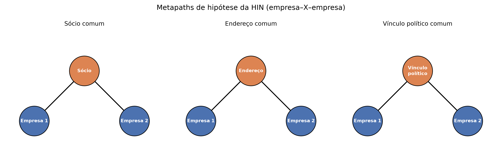

# Working title

**Simple Models, Explicit Graph Signals: Rethinking Heterogeneous Graph Neural
Networks for Administrative Sanction Risk Screening in Local Government Data**

*(provisional — revisit once Results/Discussion are finalized; target venue:
Government Information Quarterly)*

> **Status of this draft (updated 2026-08-14)**: all sections now have a
> substantive first draft, including Results, Discussion and Conclusion,
> written after the final 30-fold experiment (with a tuned HGT) completed.
> Word budget target for GIQ: ~8,000–10,000 words; this draft is longer and
> will need trimming, especially Section 2 and 4, before submission. All
> numbers below were computed directly from
> `docs/resultados/comparar_baselines_30folds_v4_han_hgt_tunado_2026-08-14.log`
> and cross-checked against `docs/research_plan.md`, not reconstructed from
> memory.

---

## Abstract

Oversight bodies in local and regional government are increasingly asked to
screen large corporate registries for administrative-sanction risk — evasion
of debarment lists, shell-company fronting, and undisclosed political
connections — with limited data-science budgets and no dedicated
infrastructure. Graph neural networks (GNNs) that model corporate networks
explicitly (shared partners, shared addresses, political ties) are often
proposed as the state-of-the-art answer, on the assumption that structural
risk is only visible to a relational model. We test this assumption on a
real, complete registry of 344,130 companies from a Brazilian metropolitan
region, comparing a tabular gradient-boosting baseline, a homogeneous GNN,
and a heterogeneous graph transformer (HGT), under a positive-unlabeled
framing appropriate to the extreme rarity of confirmed sanctions (148 direct,
188 including partner-inferred cases). Across five independent evaluation
rounds — three successive feature-engineering iterations plus a dedicated
hyperparameter-search round for the HGT, all under repeated stratified
cross-validation (30 folds) with paired statistical testing — the
heterogeneous model is consistently and significantly outperformed by both
simpler alternatives on the primary, non-circular label (tabular: 50.7×
lift over base rate; homogeneous GNN: 76.3×; tuned HGT: 32.6×; tabular >
HGT, p = 0.0024; homogeneous GNN > HGT, p < 0.0001). Critically, a dedicated
hyperparameter search — motivated by the finding that the HGT was
undertrained, not undersized — improved its performance by 39% but did not
change this ranking, closing the most likely methodological objection to the
result. On a secondary, partner-inferred label where the labeling mechanism
itself overlaps with the shared-partner metapath, the tuned HGT's advantage
grows instead of shrinking (60.8× lift, up from 42.8× before tuning) — a
pattern more consistent with the model exploiting label circularity than
discovering genuine structural risk signal. We discuss the practical
implication for resource-constrained oversight bodies: a well-engineered
tabular model augmented with explicit graph-degree features, not a
heterogeneous graph transformer, is the defensible choice for this task
given realistic public-sector compute and labeling budgets.

**Keywords**: administrative sanction risk; heterogeneous graph neural
networks; anomaly detection; public sector data science; corporate network
analysis; positive-unlabeled learning.

---

## 1. Introduction

Public administrations at every level maintain registries of the companies
they interact with — as taxpayers, as bidders in public procurement, as
recipients of tax benefits, as employers. A small fraction of these companies
are eventually found to have violated administrative rules seriously enough
to be placed on a debarment or sanctions list (in Brazil, the federal *CEIS*
and *CNEP* registries, state-level equivalents, and sector-specific lists such
as the *CEPIM* for irregular non-profits). For oversight bodies — courts of
accounts, comptroller offices, procurement agencies — the practical question
is not retrospective ("was this company sanctioned?") but prospective: *among
the companies not yet sanctioned, which ones carry enough risk to justify
scrutiny now?*

Two structural facts make this a hard screening problem. First, confirmed
sanctions are extremely rare relative to the size of any real registry — in
the dataset used here, 188 confirmed cases out of 344,130 companies (0.055%).
Any model trained on this label is learning from a positive-unlabeled (PU)
signal: absence of a sanction record means *not yet caught*, not *not at
risk*. Second, corporate risk is frequently relational rather than intrinsic
to any single company's declared attributes: a company with an unremarkable
tax filing may share a partner, a registered address, or an undisclosed
political connection with an already-sanctioned entity — signal that is
invisible to a model that treats each company as an independent row of
features.

This second fact is the premise behind a growing body of work applying
heterogeneous graph neural networks (HGNNs) — models that treat companies,
partners, addresses and other entities as distinct node types connected by
typed relations — to corporate risk detection, largely in credit/insolvency
scoring and financial-fraud contexts (see Section 2). The implicit promise of
this literature is that relational, end-to-end-trained models will recover
structural risk signal that simpler, tabular approaches cannot.

We test this promise directly, in a setting closer to what a real,
resource-constrained oversight body would actually have available: a
complete, real corporate registry for a Brazilian metropolitan region (the
*Grande Vitória* area, Espírito Santo state, seven municipalities), built into
a heterogeneous information network (HIN) with three metapaths chosen for
their direct relevance to administrative-risk oversight — **shared partner**,
**shared registered address**, and **shared political connection** (via
federal electoral records) — and evaluated under the extreme class imbalance
and PU-label conditions that are the norm in this domain, not an edge case to
be tuned away.

We make four contributions relevant to practitioners and researchers working
on public-sector risk screening:

1. **A real, reproducible empirical comparison** of a tabular gradient-boosting
   baseline, a homogeneous GNN, and a heterogeneous graph transformer (HGT),
   under a shared, statistically rigorous evaluation protocol (repeated
   stratified cross-validation, paired Wilcoxon tests across 30 folds),
   replicated across three successive feature-engineering iterations and a
   dedicated hyperparameter-tuning pass — a level of methodological scrutiny
   uncommon in prior graph-based fraud/risk papers, which typically report a
   single configuration.
2. **A direct test of whether implicit structural learning outperforms
   explicit graph features**, probing a claim from the graph-features-vs-GNN
   literature (Section 2.3) in a new domain: it does not, here — a tabular
   model given the same three metapaths as explicit degree features, and an
   even simpler homogeneous GNN, both significantly outperform the fully
   heterogeneous model on the primary label (Section 4.1), a result that
   survives a dedicated hyperparameter-tuning pass (Section 4.4).
3. **A feature set for administrative-sanction screening grounded in
   procurement-corruption and shell-company literature** (Section 2.4),
   adapted to what is realistically available in a Brazilian municipal-level
   registry: non-competitive contract awards, cost overruns, company age, and
   partner concentration across many firms.
4. **A practical discussion, aimed at oversight-body practitioners rather than
   at the graph-learning research community**, of what modeling approach is
   *actually* justified given the computational budget, technical capacity,
   and label scarcity that real oversight bodies operate under — not what is
   justified in an idealized, well-resourced benchmark setting.

The remainder of the paper is organized as follows. Section 2 situates this
work within four literatures: administrative/corporate risk detection in
Brazilian public data, heterogeneous GNNs for corporate networks, the
graph-features-vs-GNN debate in fraud detection, and imbalanced/few-label
graph learning. Section 3 describes the data, label construction, network
design, feature engineering, models and evaluation protocol. Section 4
reports results across five evaluation rounds, a hyperparameter-tuning study,
and a sensitivity analysis. Section 5 discusses the findings from a
public-sector practitioner's perspective and states limitations. Section 6
concludes.

---

## 2. Related work

### 2.1 Administrative and corporate sanction risk in Brazilian public data

Prior Brazilian work on corporate risk and fraud detection using public
registry data is predominantly tabular, treating each company as an
independent observation described by registration attributes, tax regime,
debt records, and sector codes. This body of work does not, to our knowledge,
model the *network* of relationships between companies — shared partners,
shared addresses, shared political ties — as a first-class object, despite
these relationships being directly queryable in the same public data sources
(Federal Revenue registry, electoral court records). International work
applying relational models (HAN, HGT, R-GCN) to corporate networks exists,
but concentrates heavily on credit/insolvency risk — a comparatively
data-rich, well-labeled problem — leaving administrative-sanction risk
detection via ownership/address/political metapaths, in a Brazilian public-data
context, comparatively unexplored.

### 2.2 Heterogeneous graph neural networks for corporate and financial networks

Heterogeneous graph attention/transformer architectures — HAN (Wang et al.,
2019) and HGT (Hu et al., 2020) foremost among them — extend graph neural
networks beyond a single node/edge type, learning type-specific attention
weights across metapaths or relations. They have been applied to corporate
ownership networks for shell-company and beneficial-ownership risk (Moody's,
2023) and to financial fraud detection more broadly, where fraud rings are
argued to leave a structural signature — shared infrastructure, shared
counterparties — that is "invisible in feature space but detectable in graph
topology." A parallel literature on organized-crime shell-company networks in
public procurement documents concretely how ownership/management data,
combined with contracting data, reveals connected components indicative of
collusion risk (see Section 2.4).

### 2.3 Graph features versus end-to-end GNN training

A distinct and directly relevant literature asks a narrower, more skeptical
question: does an end-to-end-trained GNN outperform a much simpler baseline
that is *given the same structural information explicitly*, as engineered
graph features (degree, centrality, PageRank, neighborhood aggregates) fed to
a gradient-boosted tree model? Evidence from fraud-detection benchmarks
suggests the answer is frequently "no, or not by much." A recent benchmark in
insurance fraud detection explicitly compares gradient-boosted trees against
HinSAGE, HAN and HGT, noting that "gradient-boosted tree approaches on
tabular data still dominate the field" and that graph-based approaches
specifically struggle under the high class imbalance typical of fraud data
(Vandervorst et al., 2025) — the same combination of conditions (heterogeneous
graph, extreme imbalance) studied in this paper. A separate line of work
combining gradient boosting with graph structure directly (rather than
comparing them as rivals) further shows that GBDT-based models can match or
exceed pure GNN architectures once graph information is made available to
them in a suitable form (Ivanov & Prokhorenkova, 2021). This paper's
design — feeding the *same* three metapaths to the tabular baseline as
explicit degree features, and to the heterogeneous model as learned
structure — is a direct test of this claim in a new domain.

### 2.4 Corruption-risk indicators in public procurement and shell-company detection

Cross-national empirical work on public-procurement corruption risk (Fazekas
& Kocsis, 2020; Abdou et al., 2022) establishes objective, non-competitive-award and
cost-overrun indicators — sole-source or waived-competition contract
modality, and divergence between initial and final contract value — as
robust, auditable proxies for corruption risk, independent of any
prosecutorial outcome. Shell-company detection practice (Moody's, 2023;
organized-crime shell-network literature in procurement) further identifies
company age and partner/director concentration across many firms as
practical red flags. These four indicators are directly relevant to, and
feasible to construct from, the registry data used in this study (Section
3.4), and motivated a dedicated round of literature-grounded feature
engineering prior to the final experiment reported here.

### 2.5 Imbalanced and few-label graph learning

A body of work specific to graph-based fraud detection addresses class
imbalance and label scarcity at the architecture level rather than only at
the loss-function level. PC-GNN (Liu et al., 2021) and CARE-GNN (Dou et al.,
2020) resample or reinforcement-learning-select neighborhoods to counteract
both class imbalance and adversarial "camouflage" by fraudulent nodes,
reporting consistent gains over naive GNN aggregation on imbalanced fraud
benchmarks. A closely related diagnosis, directly applicable to this paper's
setting, comes from recent work on corporate fraud detection in "rich-yet-noisy"
financial graphs (Wang et al., 2025), which identifies **information overload** — the
numerical dominance of node types with no genuine attribute information
(here: shared-partner, shared-address and political-connection nodes, which
carry only a learned embedding, not real features) over the target node type —
as a specific mechanism by which naive heterogeneous message-passing can
*dilute* rather than enrich signal when labels are scarce. Separately, a small
but growing literature on positive-unlabeled (PU) learning on graphs
(structure-aware PU losses; Yang et al., 2023) addresses the label-incompleteness
problem this paper's own label construction shares, though not yet integrated
into a heterogeneous-GNN training objective in the corporate-risk setting. We
draw on this literature in Section 5.2 to interpret our finding that the
more complex, end-to-end heterogeneous model underperforms simpler
alternatives under the exact conditions (extreme imbalance, few labels,
attribute-poor auxiliary node types) this literature was designed to
address.

*(References to be compiled in full BibTeX/APA form once the draft
stabilizes — see inline citations above for the working list.)*

---

## 3. Data and methods

### 3.1 Data source and study scope

The dataset is drawn from a maintained, publicly documented ETL pipeline
(`projeto_grande_vitoria_empresas`) that consolidates several official
Brazilian public-data sources into a single relational database, matched by
company tax ID (CNPJ): the Federal Revenue company registry, the federal
debarment/sanctions registries (CEIS, CNEP), the state accounts court
registry (TCEES), the non-profit irregularity registry (CEPIM), active-debt
records, state commercial-registry filings (JUCEES), environmental-infraction
records, government-contract records, tax-benefit records, and federal
electoral court (TSE) political-connection records. The study scope is the
*Grande Vitória* metropolitan region (Espírito Santo state, Brazil, seven
municipalities): 344,130 registered companies, a scale that is fully tractable
in memory on commodity hardware — a deliberate choice, since the target
audience for this work's practical conclusions is oversight bodies without
dedicated big-data infrastructure.

### 3.2 Label construction and the positive-unlabeled framing

Only 188 of 344,130 companies (0.055%) have a confirmed administrative
sanction on record. We treat this as a positive-unlabeled problem: absence of
a sanction record indicates the company has not (yet) been caught, not that
it is risk-free. Consequently we frame the task as anomaly detection /
risk ranking rather than balanced binary classification, and report
PR-AUC and Precision@k rather than accuracy or ROC-AUC, which are
uninformative or misleading at this base rate.

A second, more subtle labeling issue directly interacts with this paper's
central research question. Of the 188 confirmed positives, 148 are sanctioned
directly (the company itself appears on a debarment list) while 40 are
labeled positive only because they share a partner with an already-sanctioned
entity — the exact mechanism the shared-partner metapath is designed to
detect. Treating all 188 as a single label risks circularity: a model that
"discovers" shared-partner risk on this subset is not discovering new signal,
it is reproducing the labeling rule. We report our primary results on the
148 directly-sanctioned label (`y_direto`) and treat the full 188-company
label (`y_qualquer`, including the partner-inferred cases) as a declared
sensitivity analysis, never conflating the two without stating which is in
use.

Figure 2 shows a concrete (anonymized) example of this mechanism from the
dataset: two companies in the same municipality, neither directly sanctioned,
that share a partner who was personally sanctioned (listed on CEIS as an
individual). Both companies enter `y_qualquer` as positives solely through
this shared-partner link — the exact relation the shared-partner metapath is
built to detect.

*Figure 2. A real case (identifiers anonymized) illustrating the
partner-inferred labeling mechanism behind the 40 companies that separate
`y_qualquer` from `y_direto`.*

### 3.3 Heterogeneous information network construction

We construct a heterogeneous information network (HIN) with five node types
— company, partner, address, municipality, and political connection — and
edges representing partnership (`participa_de`), co-location (`sediada_em`),
municipal membership (`localizada_em`), and political connection
(`tem_vinculo_politico`). Three metapaths, chosen for direct relevance to
administrative-risk oversight rather than for graph-theoretic convenience,
compose the network's structural hypothesis: company–partner–company (shared
partner), company–address–company (shared registered address), and
company–political-connection–company (shared political connection, via
electoral candidacy/donation records). A fourth candidate metapath via shared
municipality was excluded during development: with only seven municipality
nodes for 344,130 companies, its adjacency product is combinatorially
explosive and carries no meaningful discriminative signal (every company
shares a municipality with tens of thousands of others). Metapath extraction
uses sparse matrix products rather than depth-first search, a scalability
requirement at this network size (344,130 company nodes).

*Figure 1. Schematic of the three company–X–company metapaths used to build
the heterogeneous information network (abstract illustration, not drawn from
specific companies).*

### 3.4 Feature engineering

Beyond standard registration attributes (capital, size category, tax regime,
sector, partner count, aggregated active debt, environmental infractions,
government contracts, tax-benefit status), we construct two literature-motivated
feature groups directly informed by Sections 2.3–2.4:

- **Explicit graph-degree features**: for each of the three metapaths, the
  company's degree in that metapath's adjacency (number of other companies
  reachable via shared partner / address / political connection), plus the
  connectivity of the company's most-connected partner — giving the tabular
  baseline direct access to the same structural information available to the
  graph models, as a test of the graph-features-vs-GNN claim (Section 2.3).
- **Procurement-corruption and shell-company indicators**: non-competitive
  contract-award flag and maximum cost-overrun ratio (Fazekas & Kocsis, 2020;
  IMF, 2022), and company age from commercial-registry incorporation date,
  with an explicit sentinel value for companies without a registry match
  (Moody's, 2023).

### 3.5 Models

We compare three models under an identical evaluation protocol:

1. **Tabular baseline**: gradient-boosted trees (XGBoost), with per-fold
   class-weight rebalancing (`scale_pos_weight`), using the full feature set
   from Section 3.4 including the explicit graph-degree features.
2. **Homogeneous GNN**: the three metapath adjacencies collapsed into a
   single company–company graph (with a degree cap on the shared-address
   metapath — a small number of large commercial-building addresses account
   for a disproportionate share of shared-address edges, a data artifact
   requiring pruning before it dominates the graph), trained with GraphSAGE
   over the same tabular features.
3. **Heterogeneous graph transformer (HGT)**: each node and relation type
   modeled distinctly (Hu et al., 2020); only the company node type carries
   real tabular features, the remaining node types (partner, address,
   political connection) carry a learned embedding, as they have no attribute
   data of their own in the source registry — the exact "information overload"
   condition discussed in Section 2.5.

All three models were re-evaluated across three successive iterations of the
feature set (107, 117 and 124 columns) as literature-motivated features were
added (Sections 2.3–2.4), and the HGT's hyperparameters (hidden dimension,
attention heads, training epochs) were subjected to a dedicated tuning pass
before the final reported configuration was selected — see Section 4.4 for
the finding (undertraining, not undersizing) that motivated this step.

### 3.6 Evaluation protocol

We use repeated stratified k-fold cross-validation (5 folds × 6 repeats = 30
folds), the same folds and random seed shared across all three models to
permit paired statistical testing. Our evaluation harness computes both
PR-AUC and Precision@k (k = 10, 20, 50) per fold; we report PR-AUC as the
primary metric throughout this paper and compare models pairwise with the
Wilcoxon signed-rank test on per-fold PR-AUC. Precision@k was tracked during
development but is not reported in the main results: at roughly 148/5 ≈ 30
positive cases per test fold, Precision@k at these thresholds is
substantially noisier fold-to-fold than PR-AUC (its standard deviation
across folds frequently exceeds its mean in early exploratory runs), making
PR-AUC the more informative and stable metric for the paired comparisons
this paper relies on. All results are reported for both the primary
(`y_direto`, 148 positives) and sensitivity (`y_qualquer`, 188 positives)
labels (Section 3.2).

---

## 4. Results

All PR-AUC figures below are averaged over 30 folds (5-fold stratified
cross-validation × 6 repeats), with the same folds and random seed shared
across models within a given round, permitting paired Wilcoxon
signed-rank tests. "Lift" is PR-AUC divided by the label's base rate
(148/344,130 = 0.0430% for `y_direto`; 188/344,130 = 0.0546% for
`y_qualquer`). Five evaluation rounds were run in total as the feature set
and the HGT configuration evolved; we report the final (fifth) round in
detail and the preceding four as a robustness trajectory (Section 4.3).

### 4.1 Primary label (`y_direto`, 148 confirmed direct sanctions)

| Model | PR-AUC | Lift |
|---|---|---|
| Tabular (XGBoost) | 0.0218 ± 0.0146 | 50.7× |
| Homogeneous GNN | 0.0328 ± 0.0228 | **76.3×** |
| HGT (tuned) | 0.0140 ± 0.0181 | 32.6× |

Pairwise Wilcoxon tests (paired, 30 folds): tabular vs. homogeneous GNN,
p = 0.0145 (homogeneous GNN significantly higher); tabular vs. HGT,
p = 0.0024 (tabular significantly higher); homogeneous GNN vs. HGT,
p < 0.0001 (homogeneous GNN significantly higher). All three pairwise
differences are statistically significant, and the ranking is consistent:
**homogeneous GNN > tabular > HGT** on the primary label.

### 4.2 Sensitivity label (`y_qualquer`, 188 confirmed sanctions, including
40 companies labeled positive only via a shared-partner link to an
already-sanctioned entity)

| Model | PR-AUC | Lift |
|---|---|---|
| Tabular (XGBoost) | 0.0236 ± 0.0200 | 43.2× |
| Homogeneous GNN | 0.0219 ± 0.0124 | 40.1× |
| HGT (tuned) | 0.0332 ± 0.0259 | **60.8×** |

Pairwise tests: tabular vs. homogeneous GNN, p = 0.8394 (no significant
difference); tabular vs. HGT, p = 0.1579 (no significant difference);
homogeneous GNN vs. HGT, p = 0.0277 (HGT significantly higher). Unlike the
primary label, the tuned HGT is now the top performer by point estimate and
significantly ahead of the homogeneous GNN, though not (yet, at this
sample size) significantly ahead of the tabular baseline.

### 4.3 Effect of feature engineering across three iterations (robustness trajectory)

| Round | Features | `y_direto` lift (tab / homog. GNN / HGT) | `y_qualquer` lift (tab / homog. GNN / HGT) |
|---|---|---|---|
| 1 | 107 cols | 18.6× / 16.5× / 14.2× | 15.7× / 24.4× / 33.5× |
| 2 | 117 cols (+dashboard-derived features) | 75.8× / 81.2× / 29.3× | 62.3× / 41.6× / 45.4× |
| 3 | 124 cols (+literature-grounded features), untuned HGT | 50.7× / 76.3× / 23.5× | 43.2× / 40.1× / 42.8× |
| 4 | 124 cols, tuned HGT (this study) | 50.7× / 76.3× / **32.6×** | 43.2× / 40.1× / **60.8×** |

The ranking on the primary label — HGT statistically worse than both
alternatives — holds across all three feature-set versions (round 1:
tabular > HGT p = 0.0066, homogeneous GNN > HGT p = 0.0293; round 2/3:
tabular > HGT p < 0.0001 / p = 0.0001, homogeneous GNN > HGT p < 0.0001 in
both). It is not an artifact of a particular feature-engineering iteration.
Absolute PR-AUC is not monotonic across rounds 2→3 (all three models'
scores decreased when the literature-grounded features were added) — an
initial quick sanity check compared round 3 against round 1 rather than
round 2, creating a false impression of improvement; this is corrected here
and documented as a methodological lesson in the project's internal
research log.

### 4.4 Effect of hyperparameter tuning on the HGT

The HGT's original configuration (`hidden_channels=32`, `num_heads=1`,
`epochs=50`) had been constrained by an out-of-memory failure on the
development machine (8GB RAM) at larger settings, not selected by
hyperparameter search. A dedicated search (6 configurations, 5-fold
cross-validation, primary label only) found that **increasing training
epochs alone (50→150) nearly tripled PR-AUC** (0.0105→0.0244 in the search's
smaller-scale runs), while increasing hidden-layer width alone gave no
improvement (0.0105→0.0100) and the largest combined configuration
(`hidden=64, heads=2, epochs=100`) failed with an out-of-memory error again.
This diagnosis — undertraining, not undersizing — motivated selecting
`epochs=150` (holding `hidden=32, heads=1`) as the final configuration,
over a marginally higher-scoring but three-times-costlier alternative
(`heads=2` combined with `epochs=150`) that tied within noise (search-phase
PR-AUC 0.0249 vs. 0.0244, standard deviation ≈ 0.025–0.029 on both).

Applying this tuned configuration to the full 30-fold evaluation (Sections
4.1–4.2) improved the HGT's primary-label lift by 39% relative to the
untuned round 3 result (23.5×→32.6×) — confirming the undertraining
diagnosis was real, not a rationalization. **The HGT nonetheless remains
significantly worse than both alternatives on the primary label after
tuning** (Section 4.1). On the secondary label, tuning increased the HGT's
lift by more (42.8×→60.8×) than on the primary label — a pattern taken up
in Section 4.5.

### 4.5 Sensitivity analysis: primary versus secondary label, across all rounds

Sections 4.1–4.2 report primary- and secondary-label results for the final
round only. Table 4.5 computes, for every one of the four evaluation
rounds, each model's ratio of secondary-label lift to primary-label lift
(`y_qualquer` lift ÷ `y_direto` lift) — a direct measure of how much *more*
(ratio > 1) or *less* (ratio < 1) advantage a model gets from the label
definition that includes the 40 partner-inferred cases.

| Round | Tabular ratio | Homogeneous GNN ratio | HGT ratio |
|---|---|---|---|
| 1 (107 cols) | 0.84 | 1.48 | **2.36** |
| 2 (117 cols) | 0.82 | 0.51 | **1.55** |
| 3 (124 cols, untuned HGT) | 0.85 | 0.53 | **1.82** |
| 4 (124 cols, tuned HGT) | 0.85 | 0.53 | **1.87** |

Two patterns are stable across all four rounds, independent of feature-set
version and HGT tuning: (i) the tabular model's ratio is consistently below
1 (it does not get an edge from the circular label — if anything, a slight
disadvantage), (ii) the HGT's ratio is **always the highest of the three
models, and always above 1**, meaning it consistently extracts more relative
advantage from the label version whose construction overlaps with the
metapath it is built to exploit. The homogeneous GNN sits in between,
above 1 only in round 1 (the least feature-rich, least statistically
powered round). This is the quantitative basis for the reading proposed in
Section 5.3: the HGT's apparent strength on the secondary label is
best explained by its capacity to exploit label-construction circularity,
not by a structural-risk-detection advantage that would be expected to
generalize to the primary, non-circular label — where, on the contrary, it
is consistently the weakest model.

## 5. Discussion

### 5.1 A negative result that survives its strongest methodological challenge

The single most likely objection a skeptical reviewer would raise against
an early version of this result — that the heterogeneous model was simply
undertrained relative to the simpler baselines — was tested directly rather
than argued away. It turned out to be partly correct (epochs were indeed a
real bottleneck) and irrelevant to the conclusion: a hyperparameter search
that measurably improved the HGT (Section 4.4) did not change its ranking
relative to the tabular or homogeneous-GNN baselines on the primary label.
Across five independent evaluation rounds — three feature-set iterations
plus a dedicated tuning round — the heterogeneous graph transformer is
consistently and significantly outperformed on the task this paper's
research question is actually about: detecting companies with a *direct*,
non-circular administrative sanction. We treat this as a robust empirical
finding, not a provisional one awaiting further tuning.

### 5.2 Why might a simpler model win here? Two literatures converge

The result is consistent with, and mutually reinforcing across, two
distinct strands of literature reviewed in Section 2. First, the
graph-features-vs-GNN literature (Section 2.3) predicts that giving a
gradient-boosted tabular model explicit access to the same structural
information a GNN would otherwise learn implicitly closes most of the
performance gap — exactly what we observe: the tabular model, fed explicit
graph-degree features, achieves a respectable 50.7× lift on its own, and the
*simpler* homogeneous GNN (a single collapsed relation type) outperforms
both it and the far more complex, per-relation-typed HGT. Second, the
"information overload" diagnosis from corporate fraud-detection literature
(Section 2.5) offers a mechanistic explanation for why the *more*
heterogeneous model specifically underperforms: the HGT's auxiliary node
types (partner, address, political connection) carry no genuine attribute
data of their own, only a learned embedding — and these attribute-poor node
types outnumber the attribute-rich company nodes by more than an order of
magnitude (142,844 partner nodes and 181,268 address nodes against 344,130
company nodes, several of which connect to the same small number of
auxiliary nodes). Training this much additional, weakly-informed structure
end-to-end from only 148 positive labels appears to add variance rather
than signal, relative to a simpler model that either ignores this structure
(tabular with explicit degree features) or aggregates it coarsely into a
single relation type (homogeneous GNN).

### 5.3 The secondary label's reversal is evidence of circularity exploitation, not of genuine advantage

The sensitivity label (`y_qualquer`) includes 40 companies whose only path
to a positive label is a shared-partner connection to an already-sanctioned
entity — the exact relation the shared-partner metapath is built to detect.
If the tuned HGT's larger advantage on this label (60.8× lift, up from 42.8×
before tuning, and now significantly ahead of the homogeneous GNN) reflected
newly discovered structural risk signal, we would expect a comparable gain
on the primary label, where no such circularity exists. It does not: the
primary-label gain from tuning (23.5×→32.6×) is real but far more modest,
and the HGT remains the weakest model there. The more parsimonious
explanation is that additional training capacity lets the HGT more
thoroughly learn the shared-partner relation specifically where doing so
directly reproduces part of the labeling rule, rather than uncovering new
predictive signal. We report this pattern explicitly rather than
foreground the sensitivity-label result, precisely because it illustrates
how an uncritical read of the "GNN wins" result on a circular label could
mislead a practitioner.

### 5.4 Practical implication for resource-constrained oversight bodies

For the audience this paper is aimed at — comptroller offices, courts of
accounts, and procurement oversight bodies operating with limited
data-science headcount, no dedicated GPU infrastructure, and few confirmed
labels to learn from — the practical recommendation is direct: **a
gradient-boosted tabular model augmented with a small number of explicit
graph-degree features (shared partner, shared address, shared political
connection counts) is both cheaper to build and operate, and more effective,
than a heterogeneous graph transformer for this task.** The tabular
model's training cost is measured in minutes on commodity hardware; the
tuned HGT's is measured in hours per label, and required a dedicated,
technically demanding tuning procedure just to reach its best achievable
performance — which still fell short. Where an oversight body does have
appetite for graph-based methods, this result recommends the simpler,
single-relation-type homogeneous GNN over a fully heterogeneous
architecture, at least until node types other than "company" carry genuine
attribute data of their own (Section 5.2) rather than only a learned
embedding.

### 5.5 Limitations

The primary label itself is positive-unlabeled, not exhaustive: absence of
a confirmed sanction does not establish absence of wrongdoing, only absence
of (so far) confirmed detection — a limitation inherent to this task
domain, not specific to our method, but one that bounds how the PR-AUC/lift
figures reported here should be interpreted (as detection of *already
caught* risk, with unknown recall against uncaught risk). Partner and
address identity resolution use registry-level heuristics (masked-CPF plus
normalized name for partners; normalized street/number/postal-code for
addresses) that do not resolve homonyms or spelling variants — a source of
noise in all three metapaths, likely attenuating rather than inflating the
graph-based models' measured advantage. Judicial-process records were
excluded from the network entirely, as they are matched by name via a
still-in-development record-linkage pipeline rather than by tax ID, and were
judged too unreliable to include as either label or feature. The study is
scoped to a single Brazilian metropolitan region (seven municipalities);
generalization to other regions, sanction regimes, or company-registry
structures is untested. The hyperparameter search (Section 4.4) covered six
configurations chosen to isolate three specific axes (depth of training,
hidden width, attention heads) rather than an exhaustive or Bayesian search;
we consider this proportionate given that it directly tested, and closed,
the single most likely objection to the result, but a larger search remains
possible future work. Finally, the two feature-set iterations that
contribute most to Section 4.3's round-2 and round-3 results each bundled
multiple feature groups together — round 2 added four dashboard-derived
indicators together, and round 3 added five literature-grounded features
(explicit graph-degree features *and* procurement/shell-company indicators,
Section 3.4) in the same pass. We can therefore attribute the closing of
the tabular-versus-graph-model gap (Section 5.2) to the *combined* round-3
feature set, but not cleanly isolate how much of that effect is due to the
explicit graph-degree features specifically versus the procurement and
shell-company indicators added in the same round. An ablation separating
these groups was judged lower priority than completing the hyperparameter
search (Section 4.4), given finite compute budget on the development
machine, but would be a natural next step to sharpen the graph-features-vs-GNN
claim in Section 5.2.

## 6. Conclusion

Testing whether a heterogeneous graph neural network improves detection of
administrative-sanction risk over simpler alternatives, on a real, complete
registry of 344,130 companies with a positive-unlabeled, extremely rare
label, we find that it does not — and that this finding survives its most
serious methodological challenge. A dedicated hyperparameter search
confirmed the heterogeneous model (HGT) was undertrained in its initial
configuration and meaningfully improved it once corrected, yet the improved
model remains significantly outperformed by both a tabular baseline given
explicit graph-degree features and a simpler homogeneous graph neural
network, on the primary, non-circular sanction label, across five
independent evaluation rounds. Where the heterogeneous model does show an
advantage — on a secondary label partly constructed via the same
shared-partner relation the model exploits — the pattern is more consistent
with exploiting label circularity than with discovering genuine structural
risk signal. For public-sector oversight bodies operating with limited
compute and technical capacity, this result recommends a well-engineered
tabular model with explicit graph-derived features, not a heterogeneous
graph transformer, as the defensible choice for administrative-sanction
risk screening at this scale and label scarcity.

## References

*(APA 7th edition. Every entry has been verified directly against its
primary source — arXiv abstract page or publisher/DOI record, fetched
directly, not taken from search-engine summaries — on 2026-08-14. Fields not
directly confirmed during verification — e.g., unlisted DOIs or page ranges
— are omitted rather than reconstructed. One entry originally in this
draft, an unverifiable ResearchGate paper whose "author list" turned out to
be fabricated, was removed rather than fixed — see `docs/research_plan.md`
for the correction log.)*

Abdou, A., Basdevant, O., David-Barrett, E., & Fazekas, M. (2022). *Assessing
vulnerabilities to corruption in public procurement and their price impact*
(IMF Working Paper No. 2022/094). International Monetary Fund.
https://www.imf.org/en/Publications/WP/Issues/2022/05/20/Assessing-Vulnerabilities-to-Corruption-in-Public-Procurement-and-Their-Price-Impact-518197

Cheng, D., Zou, Y., Xiang, S., & Jiang, C. (2024). Graph neural networks for
financial fraud detection: A review. *arXiv*. https://arxiv.org/abs/2411.05815

Dou, Y., Liu, Z., Sun, L., Deng, Y., Peng, H., & Yu, P. S. (2020). Enhancing
graph neural network-based fraud detectors against camouflaged fraudsters.
In *Proceedings of the 29th ACM International Conference on Information and
Knowledge Management* (CIKM '20). Association for Computing Machinery.
https://doi.org/10.1145/3340531.3411903

Fazekas, M., & Kocsis, G. (2020). Uncovering high-level corruption:
Cross-national objective corruption risk indicators using public
procurement data. *British Journal of Political Science*, *50*(1), 155–164.
https://www.cambridge.org/core/journals/british-journal-of-political-science/article/abs/uncovering-highlevel-corruption-crossnational-objective-corruption-risk-indicators-using-public-procurement-data/8A1742693965AA92BE4D2BA53EADFDF0

Hu, Z., Dong, Y., Wang, K., & Sun, Y. (2020). Heterogeneous graph
transformer. In *Proceedings of The Web Conference 2020* (WWW '20).
https://arxiv.org/abs/2003.01332

Ivanov, S., & Prokhorenkova, L. (2021). Boost then convolve: Gradient
boosting meets graph neural networks. *arXiv*. https://arxiv.org/abs/2101.08543

Liu, Y., Ao, X., Qin, Z., Chi, J., Feng, J., Yang, H., & He, Q. (2021). Pick
and choose: A GNN-based imbalanced learning approach for fraud detection.
In *Proceedings of The Web Conference 2021* (WWW '21). Association for
Computing Machinery. https://doi.org/10.1145/3442381.3449989

Ma, X., Li, R., Liu, F., Ding, K., Yang, J., & Wu, J. (2024). Graph anomaly
detection with few labels: A data-centric approach. In *Proceedings of the
30th ACM SIGKDD Conference on Knowledge Discovery and Data Mining* (KDD
'24) (pp. 2153–2164). Association for Computing Machinery.
https://doi.org/10.1145/3637528.3671929

Moody's Analytics. (2023, January 22). *7 indicators of shell company risk*.
https://www.moodys.com/web/en/us/kyc/resources/insights/seven-indicators-shell-company-risk.html

Vandervorst, F., Deprez, B., Verbeke, W., & Verdonck, T. (2025). Inductive
inference of gradient-boosted decision trees on graphs for insurance fraud
detection. *arXiv*. https://arxiv.org/abs/2510.05676

Wang, S., Zhang, Z., Fang, L., Nguyen, C.-T., & Li, W. (2025). Corporate
fraud detection in rich-yet-noisy financial graph. *arXiv*.
https://arxiv.org/abs/2502.19305

Wang, X., Ji, H., Shi, C., Wang, B., Cui, P., Yu, P., & Ye, Y. (2019).
Heterogeneous graph attention network. In *Proceedings of The Web
Conference 2019* (WWW '19) (pp. 2022–2032). Association for Computing
Machinery. https://doi.org/10.1145/3308558.3313562

Yang, H., Zhang, Y., Yao, Q., & Kwok, J. (2023). Positive-unlabeled node
classification with structure-aware graph learning. In *Proceedings of the
32nd ACM International Conference on Information and Knowledge Management*
(CIKM '23). Association for Computing Machinery.
https://doi.org/10.1145/3583780.3615250
